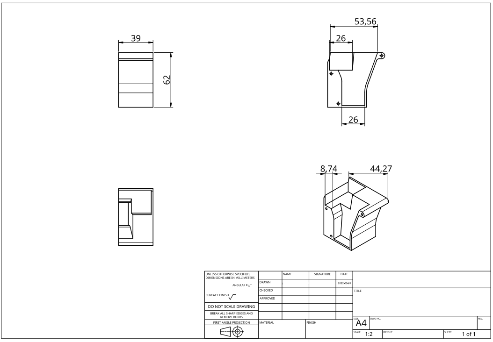
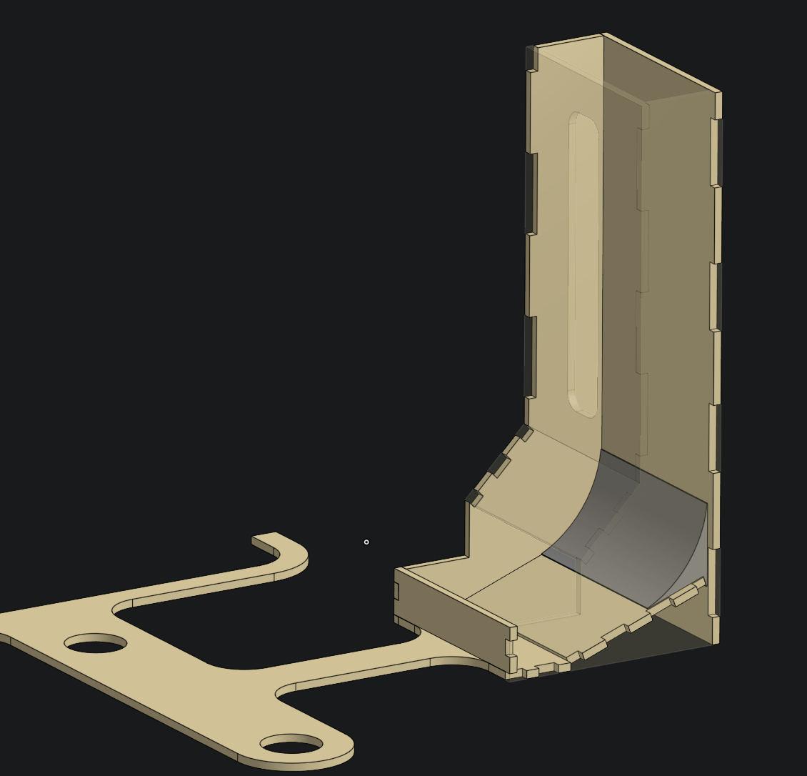

# Kapla-Tower
## A robotic project about two dobot and a conveyor building a 'Kapla'-tower

## Rotation piece

## Shop

## Context
This project was our final robotic project, of the robotic course, at the IUT of Bordeaux.

We were a group of four students, one from Computer Science, two from Electrical Engineering and Industrial Computing and one from Physical Measurements.

[Dobot Magician Used](https://www.generationrobots.com/fr/402744-bras-robotique-dobot-magician-version-basique.html)